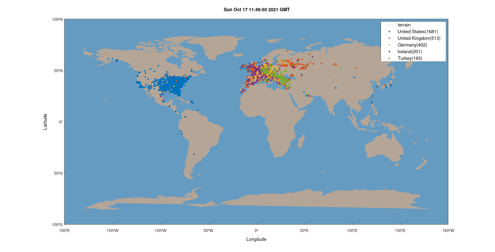

# opensky-plot

Plot aircraft coordinates retrieved from [OpenSky Network](https://opensky-network.org/) grouped by country of origin.\
Aircraft states JSON-file could be obtained by running:
```sh
curl -s "https://opensky-network.org/api/states/all" > opensky.json
```
